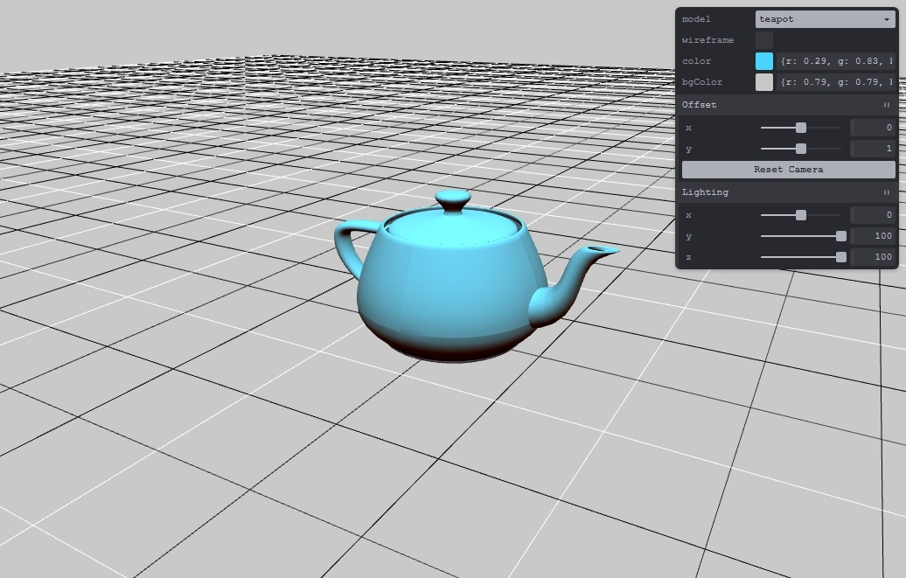
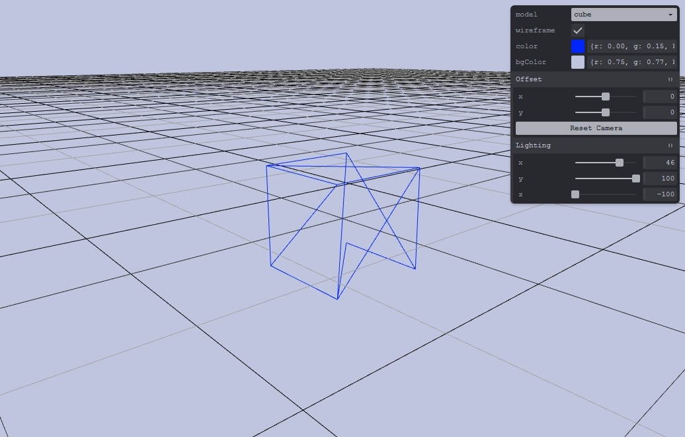

# WebGL2 Model Viewer

A model viewer built using JavaScript and WebGL2. Supports user input to adjust the camera perspective and provides various options to adjust the rendering settings. Basic lighting is implemented using the [Lambertian reflection model](https://en.wikipedia.org/wiki/Lambertian_reflectance).

# Screenshots



# Building and running
```
git clone https://github.com/matekdev/WebGL2-Model-Viewer.git
cd WebGL2-Model-Viewer
npm install
npm start
```

# Libraries
- [gl-matrix](https://github.com/toji/gl-matrix)
- [tweakpane](https://github.com/cocopon/tweakpane)
- [webgl-obj-loader](https://github.com/frenchtoast747/webgl-obj-loader)